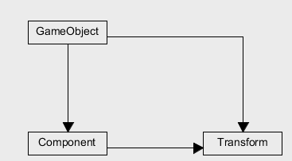

1、简答题
>解释 游戏对象（GameObjects） 和 资源（Assets）的区别与联系。

游戏中的每个对象（从角色和可收集物品到光源、摄像机和特效）都是游戏对象。但是，游戏对象本身无法执行任何操作；需要向游戏对象提供属性，然后游戏对象才能成为角色、环境或特效。
游戏对象是出现在游戏场景中的所有物体，是资源整合的具体表现。游戏对象有专有属性，是能够容纳实现实际功能的组件。游戏程序空间中的事物，可能是 Empty（空，最有用的事物）、2D、3D、光线、摄像机等
资源是可以在游戏或项目中使用的任何项目的表示。资源可能来自Unity之外创建的文件，例如3D模型、音频文件、图像或Unity支持的任何其他类型的文件。还有一些资源类型可以在Unity中创建，比如动画控制器、音频混频器或渲染纹理。
构造游戏对象、装饰游戏对象、配置游戏的物体和数据。即序列化的或存储格式的游戏对象或数据
二者的联系：游戏对象可以作为资源保存（从场景拖到资源栏）。资源可以作为组建或游戏对象创建游戏对象实例，资源还可以被多个游戏对象使用，成为游戏对象的属性。
游戏对象是一个具体的实例，资源包括诸多游戏素材。游戏对象是资源中的一部分，资源中不仅仅包括游戏对象，还有一些源代码文件、音频文件、图片文件等。


>下载几个游戏案例，分别总结资源、对象组织的结构（指资源的目录组织结构与游戏对象树的层次结构）    


资源的目录组织包括：  
Animation: 用于设置物体发生变化时的动画 
Material: 包括制作游戏的材质  
Prefab: 包括GameObjects的各种预制  
Scripts: 源代码文件，用于指定物体的行为、变化的脚本  
Font: 字体  
Scenes场景背景文件  
Textures所有的贴图
models 游戏中使用的模型  
fungus和sprites都是游戏里的角色  
  
>编写一个代码，使用 debug 语句来验证 MonoBehaviour 基本行为或事件触发的条件
基本行为包括 Awake() Start() Update() FixedUpdate() LateUpdate()
常用事件包括 OnGUI() OnDisable() OnEnable()    
Test.cs:
```
using System.Collections;
using System.Collections.Generic;
using UnityEngine;
 
public class Test : MonoBehaviour {
	void Awake() {
		Debug.Log ("This Awake!");
	}
 
	// Use this for initialization
	void Start () {
		Debug.Log ("This Awake!");
	}
	
	
	void Update () {
		Debug.Log ("This Update!");
	}
 
	void FixedUpdate() {
		Debug.Log ("This FixedUpdate!");
	}
 
	void LateUpdate() {
		Debug.Log ("This LateUpdate!");
	}
 
	void OnGUI() {
		Debug.Log ("This OnGUI!");
	}
 
	void OnDisable() {
		Debug.Log ("This OnDisable!");
	}
 
	void OnEnable() {
		Debug.Log ("This OnEnable!");
	}
}

```
拖拽到cube上运行结果如下：  


>查找脚本手册，了解 GameObject，Transform，Component 对象
分别翻译官方对三个对象的描述（Description）    

GameObject：GameObjects are the fundamental objects in Unity that represent characters, props and scenery. They do not accomplish much in themselves but they act as containers for Components
, which implement the real functionality.
翻译：GameObject是统一体中代表游戏角色、道具和场景的基本对象。它们本身并没有完成多少工作，但是它们充当组件的容器，组件实现真正的功能。

Transform：The Transform is used to store a GameObject
’s position, rotation, scale and parenting state and is thus very important. A GameObject will always have a Transform component attached - it is not possible to remove a Transform or to create a GameObject without one.
翻译：Transform用于存储GameObject的位置、旋转、缩放和父元素的状态，因此非常重要。每个GameObject都有一个Transform组件而且不可删除，所以不能创建一个没有Transform的GameObject。

Component：Components are the nuts & bolts of objects and behaviors in a game. They are the functional pieces of every GameObject.
翻译：组件是游戏中对象和行为的螺母和螺栓。它们是每个游戏对象的功能部件。

  
>描述下图中 table 对象（实体）的属性、table 的 Transform 的属性、 table 的部件
本题目要求是把可视化图形编程界面与 Unity API 对应起来，当你在 Inspector 面板上每一个内容，应该知道对应 API。
例如：table 的对象是 GameObject，第一个选择框是 activeSelf 属性。
用 UML 图描述 三者的关系（请使用 UMLet 14.1.1 stand-alone版本出图）

  
table对象的属性：
activeSelf（对象在本地是否为active）为active
ObjectName（对象名）为table
Tag（标签）为untagged
Layer为default
prefabs(预设,，分为选中，翻转和应用)
transform的属性：
Position（中心坐标）为（0，0，0）
Rotation（旋转角度）为（0，0，0）
Scale（规模）为（1，1，1）
部件：
Mesh Filter :说明对象 mesh 结构；
Box Collider :说明盒结构
Mesh Renderer:mesh 结构渲染器

  
>资源预设（Prefabs）与 对象克隆 (clone)
预设（Prefabs）有什么好处？
  
预设 (Prefab) 是存储在工程视图中可重复使用的游戏对象 ，它可以放入多个场景中，并且每个场景可以使用多次，当我们向一个场景中添加一个预设时，就会创建它的一个实例，所以无论工程中有多少个实例，当我们对预设做出更改时，这些更改会运用与所有实例，这就使得游戏制作起来更加高校和便捷。

>预设与对象克隆 (clone or copy or Instantiate of Unity Object) 关系？  

对象克隆需要场景中事先已存在对象，而预设允许场景中无对象存在，它只需事先创建预制即可，而场景中不存在对象时无法创建克隆对象；其次预设创建出的对象会根据预设的改变而改变，而克隆创建出的对象不会随被克隆对象的改变而改变。


>制作 table 预制，写一段代码将 table 预制资源实例化成游戏对象
```
using System.Collections;
using System.Collections.Generic;
using UnityEngine;

public class InitBeh : MonoBehaviour {
	public GameObject My_Table;
	// Use this for initialization
	void Start () {
		GameObject ins = (GameObject)Instantiate (My_Table, new Vector3(0,Random.Range(0,10),0), transform.rotation);
	}

	// Update is called once per frame
	void Update () {
	}
}
```


2、 编程实践，小游戏
游戏内容： 井字棋 或 贷款计算器 或 简单计算器 等等
技术限制： 仅允许使用 IMGUI 构建 UI
作业目的：
了解 OnGUI() 事件，提升 debug 能力
提升阅读 API 文档能力

完成的游戏项目为井字棋
这个项目制作比较简单，仓库中只上传了生成棋盘的c#脚本。
需要助教在场景中创建一个空对象，然后将chessboard脚本拖到这个空对象上，就可以运行演示了，另外在b站上传了演示视频，链接如下：